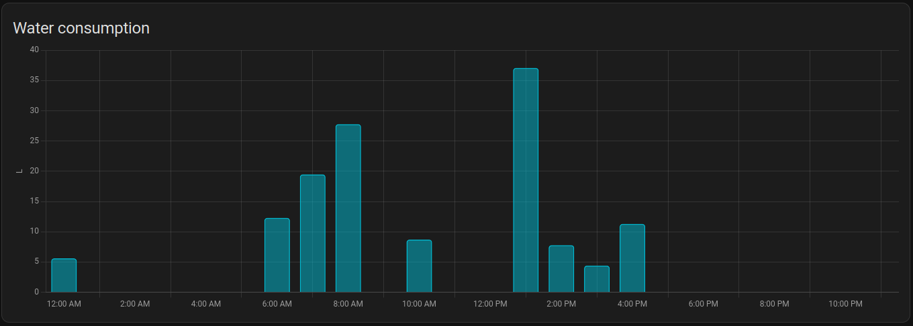
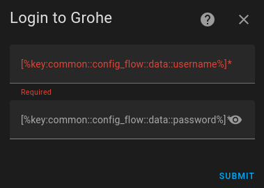
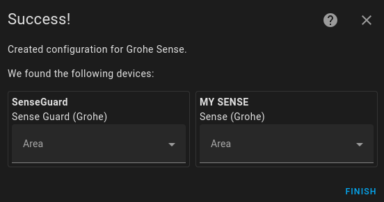

# Home Assistant - Grohe Sense (Sense and Blue)

Grohe Sense and Grohe Blue integration for Home Assistant

This is an integration to get Grohe Sense (small leak sensor) and Grohe Sense Guard (main water pipe sensor/breaker) sensors into Home Assistant.
Additionally, also the Grohe Blue Professional (water filter with carbonation) is now integrated into Home Assistant
Far from production quality, not affiliated with Grohe. 
My understanding of the protocol is based on https://github.com/FlorianSW/grohe-ondus-api-java.

## Devices
Below is a list of supported devices.

### Grohe Sense
When you install this, you get the following sensors for Sense:
 - **humidity**
 - **temperature**
 - **notifications**

It's a small, battery-powered device, so don't expect frequent updates. 
It seems to measure every hour, but the app also said it only uploads every 24h. 
The sensors I implemented only give the latest measurement returned from the server.

### Grohe Sense Guard 
When you install this, you get the following sensors for each Sense Guard:
 - **water_consumption** (as total increasing)
 - **flow_rate**
 - **pressure** 
 - **temperature**
 - **notifications**

You will also get a valve device (so, be careful with `group.all_switches`, as that now includes your water) called
 - **valve**

The Sense Guard uploads data to its server every 15 minutes (at least the one I have), so don't expect to use this for anything close to real-time. 
For water withdrawals, it seems to report the withdrawal only when it ends, so if you continuously withdraw water, I guess those sensors may stay at 0. 
Hopefully, that would show up in the flow_rate sensor.

### Grohe Blue Professional

When you install this, you get the following sensors for each Grohe Blue Professional:

- **cleaning_count**
- **date_of_cleaning**
- **date_of_co2_replacement**
- **date_of_filter_replacement**
- **filter_change_count**
- **max_idle_time**
- **open_close_cycles_carbonated**
- **open_close_cycles_still**
- **operating_time**
- **power_cut_count**
- **pump_count**
- **pump_running_time**
- **remaining_co2**
- **remaining_filter**
- **time_since_last_withdrawal**
- **time_since_restart**
- **time_offset**
- **water_running_time_carbonated**
- **water_running_time_medium**
- **water_running_time_still**
- **remaining_filter_liters**
- **remaining_co2_liters**

Thanks to 

### For all devices
The notifications sensor is a string of all your unread notifications (newline-separated).
I recommend installing the Grohe Sense app, where there is a UI to read them (so they disappear from this sensor).
On first start, you may find you have a lot of old unread notifications. 
The notifications I know how to parse are listed in `ondus_notifications` in `ondus_notifications.py`. 
If the API returns something unknown, it will be shown as `Unknown: Category %d, Type %d`. 
If you see that, please consider submitting a bug report with the `category` and `type` fields from the JSON + some description of what it means.
This can be found by finding the corresponding notification in the Grohe Sense app.

## Automation ideas
- Turning water off when you're away (and dishwasher, washer, et.c. are not running) and turning it back on when home again.
- Turning water off when non-Grohe sensors detect water.
- Passing along notifications from Grohe sense to Slack (note that there is a polling delay, plus unknown delay between device and Grohe's cloud)
- Send Slack notification when your alarm is armed away and flowrate is >0 (controlling for the high latency, plus dishwashers, ice makers, et.c.).

Graphing water consumption is also nice. Note that the data returned by Grohe's servers is extremely detailed, so for nicer graphs, you may want to talk to the servers directly and access the json data, rather than go via this integration.

## Energy dashboard
If a Sense Guard is installed, the water consumption sensor can be used to integrate into the energy dashboard.

## Installation

### Step 1: Download the files

#### Option 1: Via HACS
- Make sure you have HACS installed. If you don't, run `curl -sfSL https://hacs.xyz/install | bash -` in Home Assistant.
- Choose Integrations under HACS. Click the '+' button on the bottom of the page, search for 
  "Grohe Sense", choose it, and click install in HACS.

#### Option 2: Manual
- Clone this repository or download the source code as a zip file and add/merge the `custom_components/` folder with its contents in your configuration directory.

### Step 2: Get your Grohe authentication token

#### Via config flow
The component supports the config flow of home assistant. 

After you have added the component and restarted home assistant, you can search for 'Grohe Sense':

After selecting the component you can enter your credentials (username/password):

If everything went well, you get a list of all your found devices, and you can assign them to an area (new or existing):

When you've clicked on finish the devices are added to home assistant and can be managed via UI.

## Remarks on the "API"
I have not seen any documentation from Grohe on the API this integration is using, so likely it was only intended for their app.
Breaking changes have happened previously, and can easily happen again.
I make no promises that I'll maintain this module when that happens.

The API returns _much_ more detailed data than is exposed via these sensors.
For withdrawals, it returns an exact start- and endtime for each withdrawal, as well as volume withdrawn.
It seems to store data since the water meter was installed, so you can extract a lot of historic data (but then polling gets a bit slow).
I'm not aware of any good way to expose time series data like this in home assistant (suddenly I learn that 2 liters was withdrawn 5 minutes ago, and 5 liters was withdrawn 2 minutes ago).
If anyone has any good ideas/pointers, that'd be appreciated.

## Credits
Thanks to:
 - [gkreitz](https://github.com/gkreitz/homeassistant-grohe_sense) for the implementation and to [weissm](https://github.com/weissm/homeassistant-grohe_sense) from whom I forked the repository.
 - [rama1981](https://github.com/rama1981) for reaching out and going through the trial and error for the Grohe Blue Professional.
 - [windkh](https://github.com/windkh/node-red-contrib-grohe-sense) from whom I've token a lot of the notification types available.